# 🧠 ZAIRE SYSTEMS — SNOWMAN v1

**Smart communication system for winter helmets and snow gear**  
*Retrofit sleeve-based wearable communication platform*

---

## 🚀 Overview

**Snowman v1** is a modular retrofit communication system developed under **Zaire Systems**. It is designed to upgrade existing ski and snowboard helmets without requiring users to replace the helmet they already trust.

The project originally explored a broader smart-helmet architecture with camera capture, hidden batteries, button controls, and onboard embedded features. Over time, the product direction became more focused: a smaller wearable retrofit system centered on **communication, connectivity, Bluetooth audio, local configuration, and practical winter-sports use**.

The form factor changed, but the core mission stayed the same:

> **Communication + Connectivity + Wearable Simplicity**

---

## 🎯 Core Features

- 🎧 **Bluetooth audio** for music, calls, and future audio features
- 📡 **Walkie-talkie communication** using ESP-NOW
- 🎛️ **On-ear / sleeve controls** designed around glove-friendly interaction
- 🔋 **External lithium battery system** for wearable operation
- 🌐 **Web-based settings portal** served directly from the device
- 🧠 **Persistent settings** using NVS storage
- ⚡ **USB-C charging and power-management architecture**
- 🧩 **Retrofit sleeve design** intended to work with existing helmet gear

---

## 📸 Prototype Evidence

Snowman is not just a concept. The project includes real embedded hardware, board fabrication, module testing, and earlier helmet-phase prototypes.

### Current Snowman Hardware

| Image | Description |
|---|---|
| 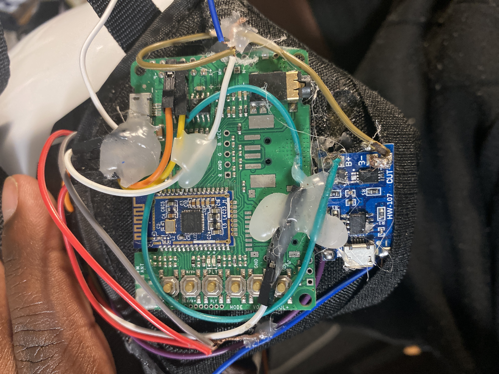 | Main Snowman board fabricated through JLCPCB. Feasycom module soldered during prototype assembly; ESP32-side assembly still in progress at this stage. |
| 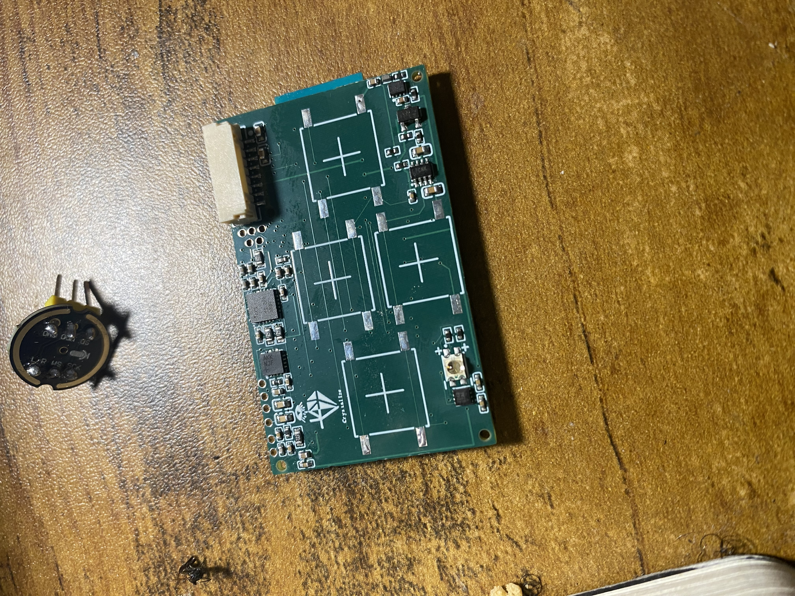 | Sleeve main board fully built from the button side. |
| 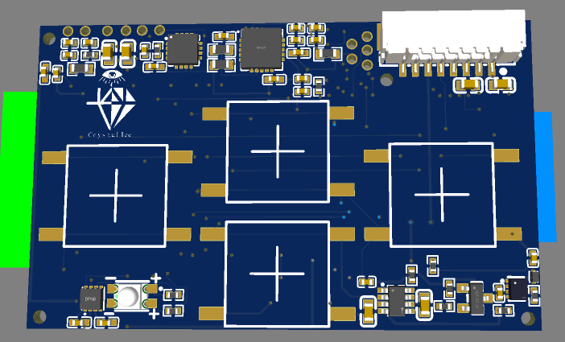 | 3D PCB render showing the main board from the button/control side. |
| 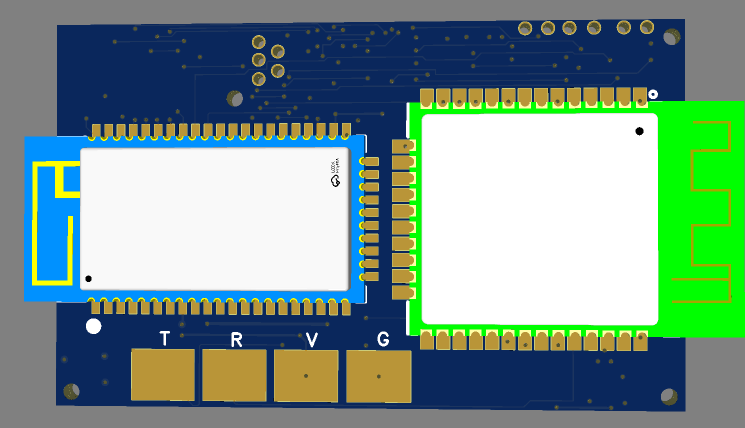 | 3D PCB render showing the ESP32 / Feasycom module side. |
| 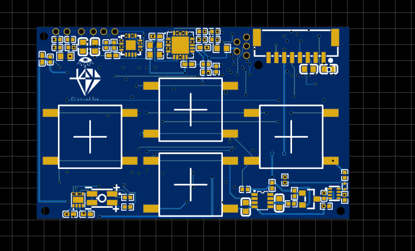 | 2D board layout view of the sleeve main board. |

---

## 🔋 Power System

Snowman uses a lithium battery-powered architecture designed for wearable use.

### Power Highlights

- **3.7 V 3200 mAh lithium battery**
- **USB-C charging input**
- **TP4056-based charging stage**
- **MAX17048 fuel-gauge monitoring over I2C**
- **LTC2954 pushbutton power sequencing**
- **Regulated logic rail for the ESP32-class embedded controller**
- **Low-battery feedback through firmware-controlled alerts**

| Image | Description |
|---|---|
| 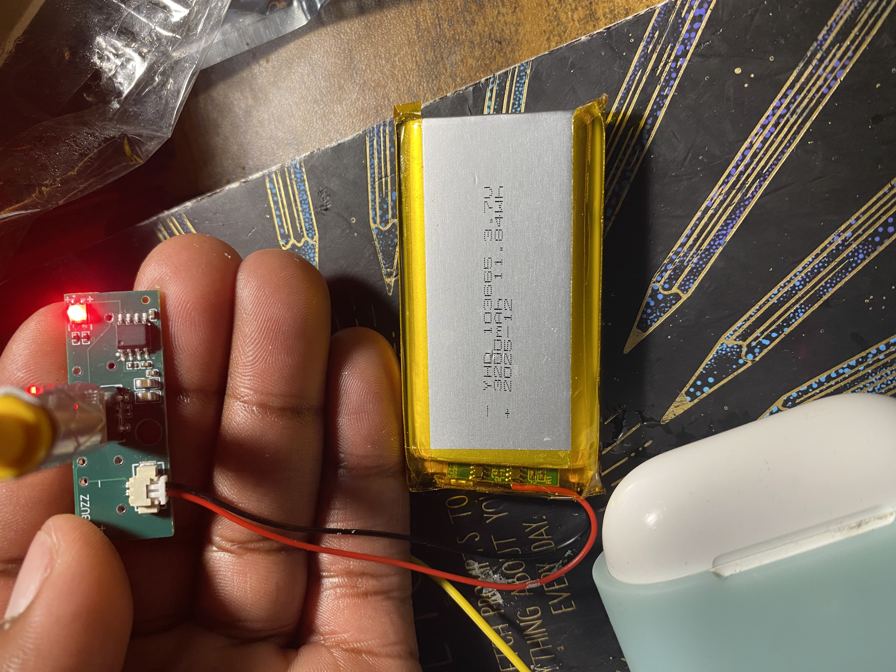 | TP4056-based charging board connected to a 3200 mAh, 3.7 V lithium battery. |
| 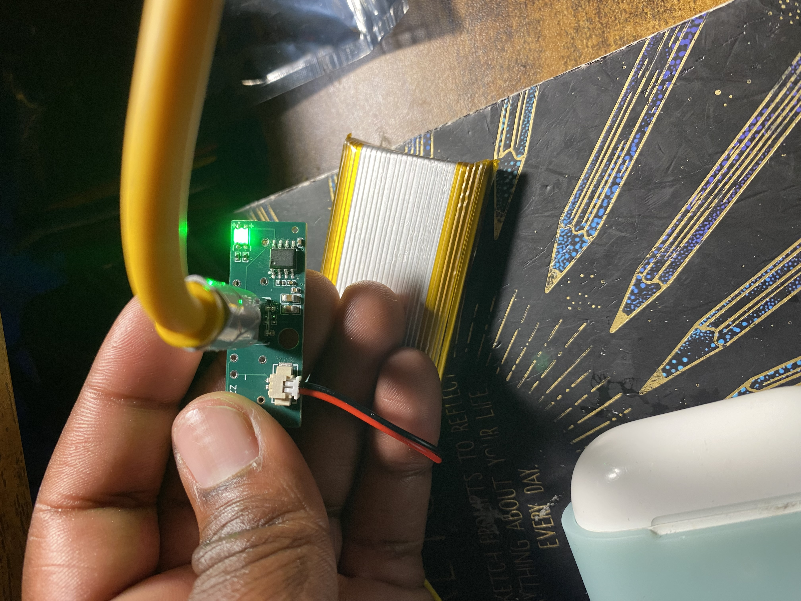 | Prototype hardware powered in standby/testing state during power-system validation. |
| 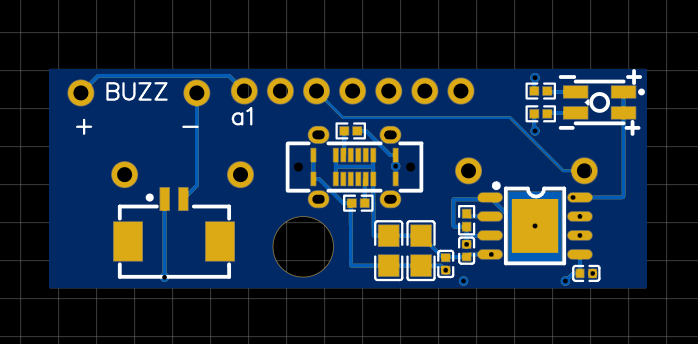 | 2D view of the battery/power board direction. |

For more detail, see:

- [`docs/power.md`](docs/power.md)
- [`images/schem/`](images/schem/)

---

## 🎧 Wireless + Audio Development

Snowman separates peer-to-peer communication from Bluetooth audio behavior.

### Communication Layer

- Uses **ESP-NOW** for local peer-to-peer walkie-style communication.
- Avoids relying on cellular service or a phone network.
- Keeps the MVP focused on short-range group communication and wearable usability.

### Bluetooth Audio Layer

The audio architecture went through multiple module iterations during development.

- Early Bluetooth audio testing used **JDY-67** connected to ESP32-S3 over UART.
- Later direction moved toward **Feasycom** modules for a cleaner module strategy and future certification planning.
- Audio module control is treated as a separate firmware layer so hardware can evolve without rewriting the full system.

| Image | Description |
|---|---|
| 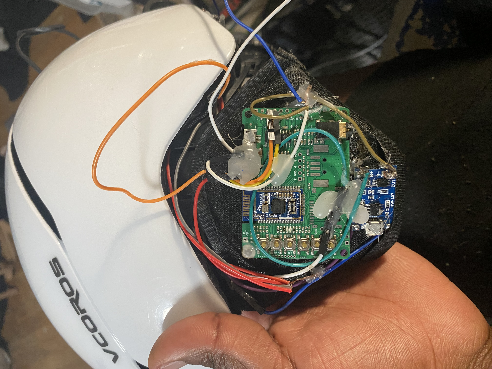 | JDY-67 Bluetooth audio module attached to ESP32-S3 via UART during earlier audio-module testing. |
| 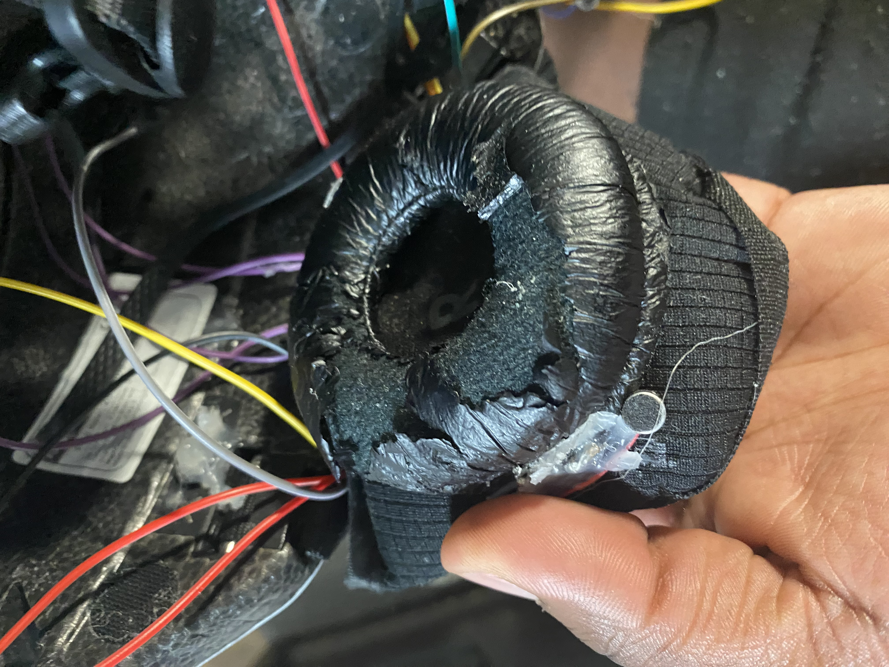 | DAC/microphone-related hardware testing on the earmuff side during the JDY-67 phase. |

For more detail, see:

- [`docs/wireless_audio_decisions.md`](docs/wireless_audio_decisions.md)

---

## 🏗️ System Architecture

### Form Factor

Snowman is currently focused on a **sleeve-based retrofit design**:

- Sleeve wraps around or mounts near existing helmet earmuff areas
- Speaker/audio hardware is positioned near the ear
- PCB and controls are placed for external access
- Battery system is designed to be hidden or mounted cleanly
- Controls are designed around winter use and glove-friendly interaction

### Firmware Architecture

Snowman firmware is organized around separate responsibilities:

- System initialization
- Button and user-input handling
- ESP-NOW communication
- Bluetooth audio module control
- Captive portal settings
- NVS/SPIFFS storage
- Power-state behavior
- Battery monitoring and alerts

For more detail, see:

- [`docs/architecture.md`](docs/architecture.md)
- [`docs/firmware_tasks.md`](docs/firmware_tasks.md)
- [`docs/hardware_overview.md`](docs/hardware_overview.md)

---

## 🧪 Legacy Helmet-Phase Prototypes

Earlier Zaire prototypes were built around a smart-helmet direction. Those experiments helped test battery placement, camera mounting, web-portal image display, and physical controls.

Camera support and helmet-specific hardware were later removed from the Snowman MVP to simplify the product and focus on communication/connectivity.

| Image | Description |
|---|---|
| 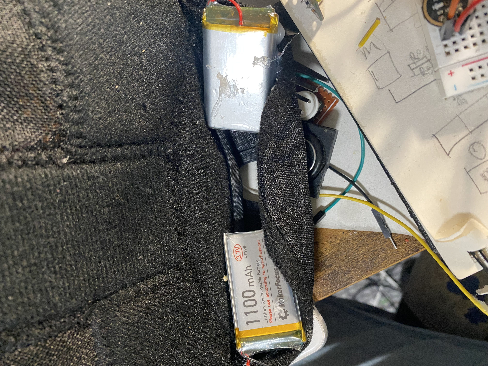 | Early helmet-phase battery placement experiment. |
| 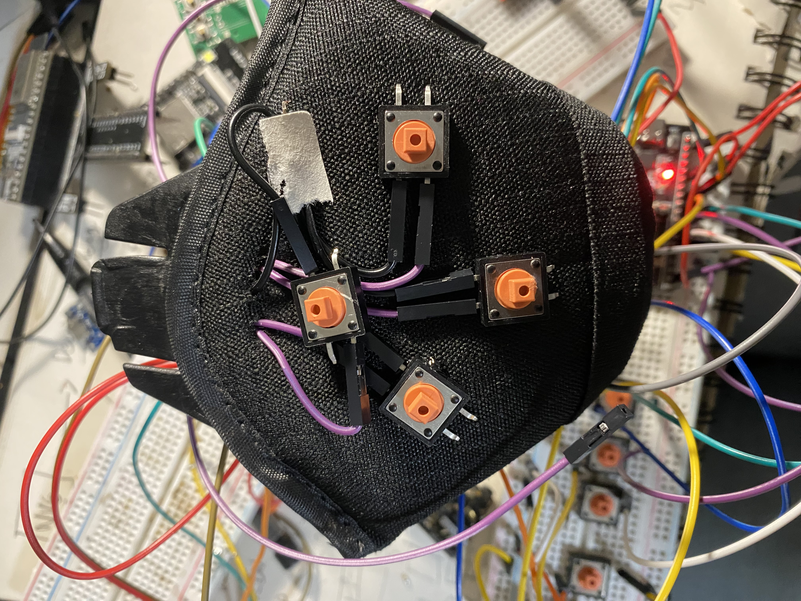 | Button mounted on the helmet earmuff for glove-friendly control testing. |
| 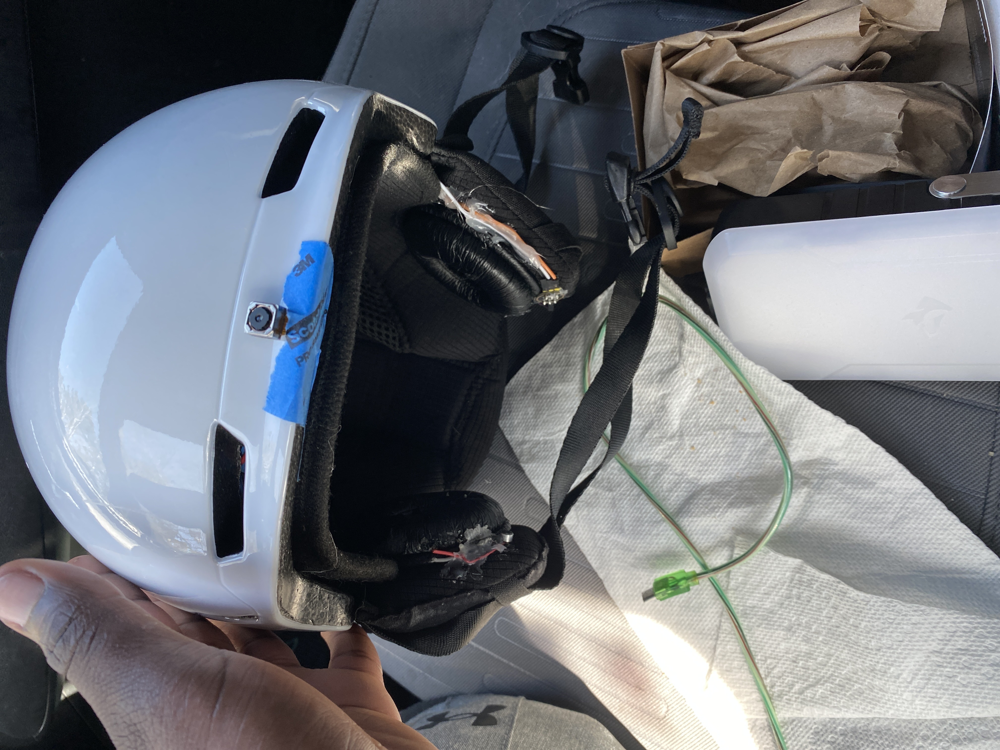 | Legacy camera placement from the smart-helmet phase. |
| 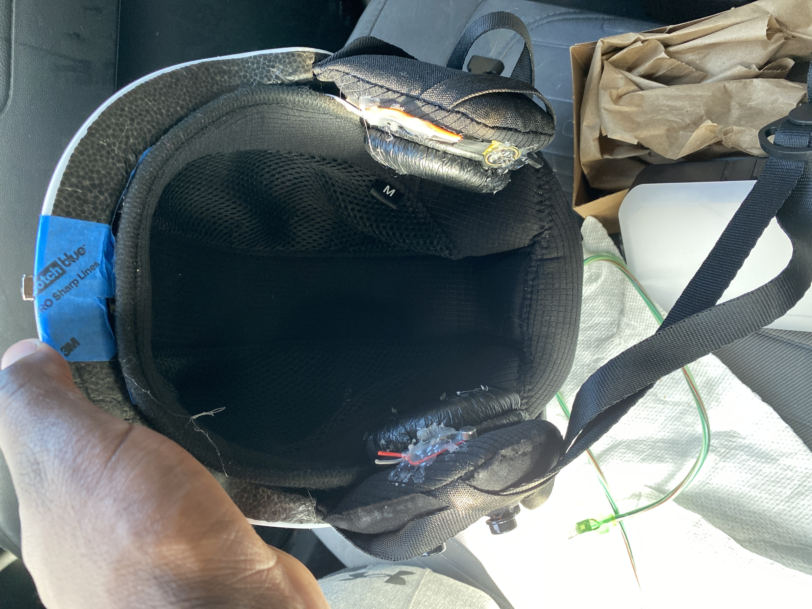 | Hidden battery layout using two 1100 mAh cells during the helmet phase. |
| 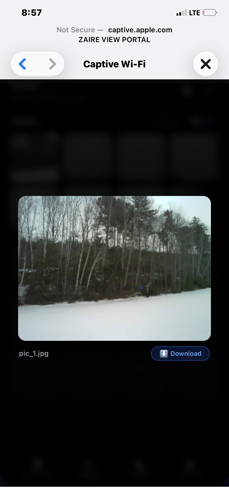 | Camera capture displayed through the device-hosted web portal. |
| 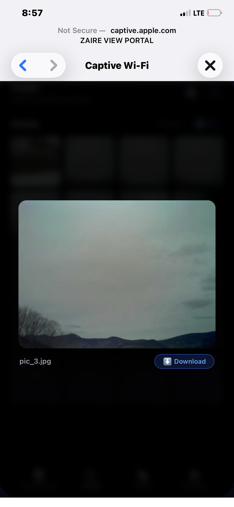 | Captured image loaded from local embedded storage and displayed through the web portal. |

---

## ⚙️ Technical Stack

### Firmware / Embedded

- C / C++
- ESP-IDF
- FreeRTOS
- ESP32 / ESP32-S3 development
- ESP-NOW
- UART
- I2C
- SPI
- I2S
- GPIO

### Storage / Configuration

- NVS
- SPIFFS
- JSON-style configuration models
- Captive portal web interface

### Hardware

- Custom PCB design
- EasyEDA
- JLCPCB fabrication
- USB-C charging
- Lithium battery charging
- Battery monitoring
- Pushbutton power sequencing
- Bluetooth audio modules
- Pre-certified module planning

---

## 🔌 Build / Setup

> This public repository is a sanitized preview and may not contain the complete production firmware required to build the full Snowman system.

Typical ESP-IDF workflow:

```bash
idf.py build
idf.py flash
idf.py monitor
```

Recommended environment:

- ESP-IDF v5+
- ESP32 / ESP32-S3 target hardware
- USB serial connection
- Git
- VS Code or ESP-IDF command-line workflow

---

## 🔒 Public Preview Notice

This repository is a **sanitized public engineering preview**.

It is intended to demonstrate:

- embedded systems architecture
- firmware organization
- hardware iteration
- power-system planning
- wireless/audio design decisions
- prototype development progress

This repository does **not** include:

- full production firmware
- complete schematics
- Gerber files
- proprietary security logic
- full pairing/protocol behavior
- production manufacturing files
- private credentials or keys

---

## 👤 Author

**Yann Kabambi**  
Founder / Embedded Systems Developer — Zaire Systems

- GitHub: [Yannsean22](https://github.com/Yannsean22)
- Portfolio: [yannkabambi.com](https://www.yannkabambi.com/)
- LinkedIn: [yann-kabambi](https://www.linkedin.com/in/yann-kabambi/)

---

## 🧭 Project Direction

Snowman v1 is currently advancing toward a focused MVP centered on:

- wearable communication
- Bluetooth audio
- local device configuration
- battery-powered operation
- winter-sports usability
- practical embedded product design

The long-term goal is to build useful connected sports hardware that feels simple, rugged, and natural to use outdoors.
